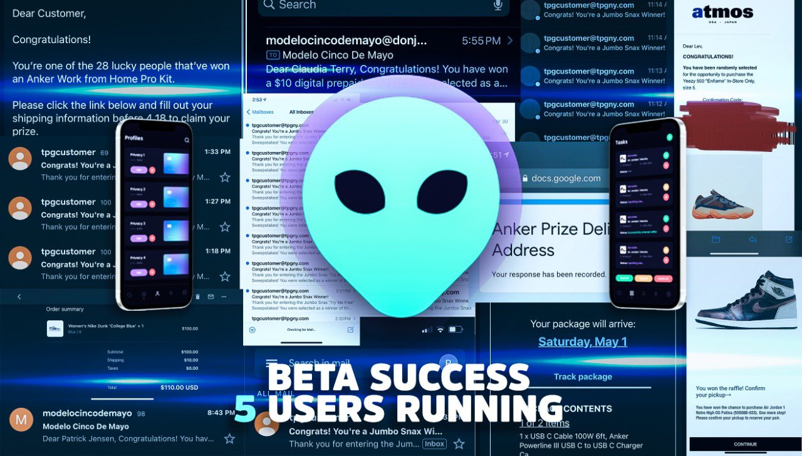
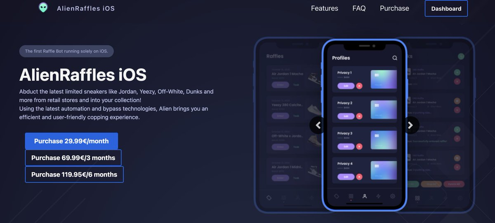

## Varzis
This is the app I'm currently building as a personal project, I'm planning on publishing it on the appstore when finished, however it's still not done so I will only leave some screenshots of it on my phone for now! 

The app function is to show news, live scores and standings amongst other things. It's focused on the MLB and NBA for now, however I may add more leagues in the future if the demand is there(since the idea was to specifically have those two leagues). 

## Some Screenshots of the app running on my iPhone

##### 🔨Technologies: Swift, SwiftUI, MVVM Architecture, RestAPI + JSON.
##### 🚀Platform: 📱iOS, iPad.

## Alien Raffles
Alien Raffles turns your iOS device into a raffle automation machine. It allows users to mass enter raffles, helping them win all types of items. It allows for users to import proxies for avoiding ip bans, it also allows thousands of entries simmulatenously to make the user experience as fast and simple as possible.

The app was developed with SwiftUI and Combine. It also allowed for push notifications using Firebase, external repositories were used as well through Cocoapods.
I was the sole mobile developer of the app for iOS, iPad and Mac.
The app had hundreds of paying users and gained users 6 figures worth of profit combined.
Not available on the appstore since it was distributed through testflight.

##### 🔨Technologies: SwiftUI, MVVM + Clean Architecture, Push Notifications, Combine, API for user credentials.
##### 🚀Platform: 📱iOS, iPad, Mac.

## Some Pictures from when the project was ongoing

## Screenshot of Website(it's now defunct)

